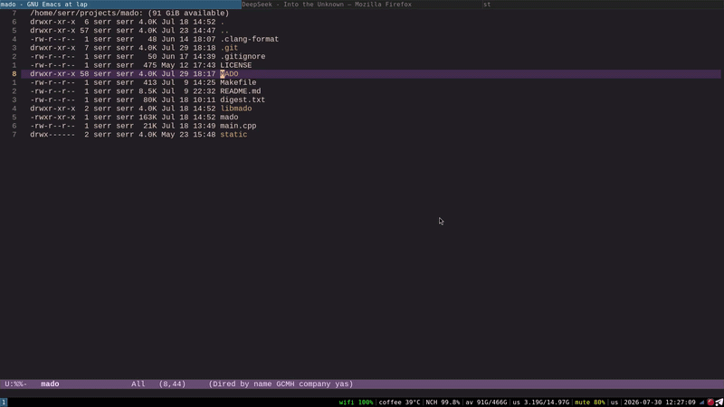
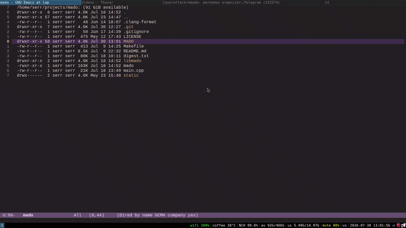
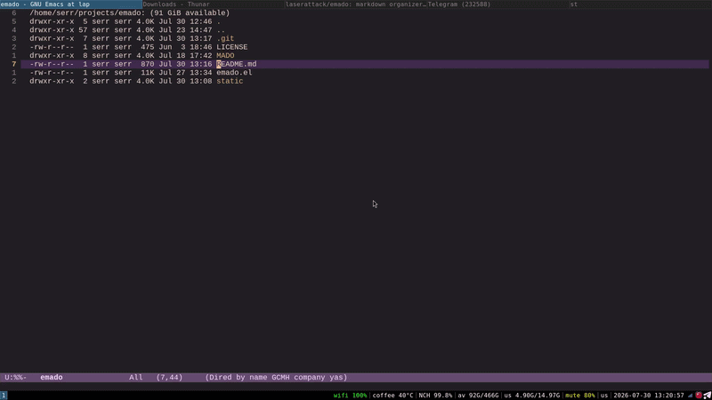

# emado - Emacs interface for mado

A pretty Emacs interface for
[mado](https://github.com/laserattack/mado) — a markdown-based
task/notes organizer

Entries stored as `MAIN.md` files in timestamped directories
(`YYYYMMDDTHHMMSS/MAIN.md`) in `MADO/` directory. The entry directory
can also contain any additional files related to the entry —
attachments, screenshots, logs, scripts, etc. Everything stays
organized in one place

## Usage example

### Searching for entries that match the query



### Create, search, delete

The video also demonstrates the engine's substring-based keyword
matching (for example: `de` match `deadline` keyword)



### Working directory

By default, the notes directory is found by walking upward through the
parent folders — similar to how Git looks for its `.git` folder. This
is convenient when working with project-specific notes or tasks, but
less so when you want to interact with a specific notes folder, like a
global one for all your personal notes. There is an option to
force-set the working directory manually



### Other...

Other usage examples and detailed documentation are available in the
[mado](https://github.com/laserattack/mado) repository

## Installation

To install, copy `emado.el` to a directory in your Emacs
`load-path`. Then add this to your configuration:

```elisp
(require 'emado)
(global-set-key (kbd "C-c e") 'emado-info)
```

## Requirements

- Emacs 28.1 or later
- `mado` executable in `PATH`
