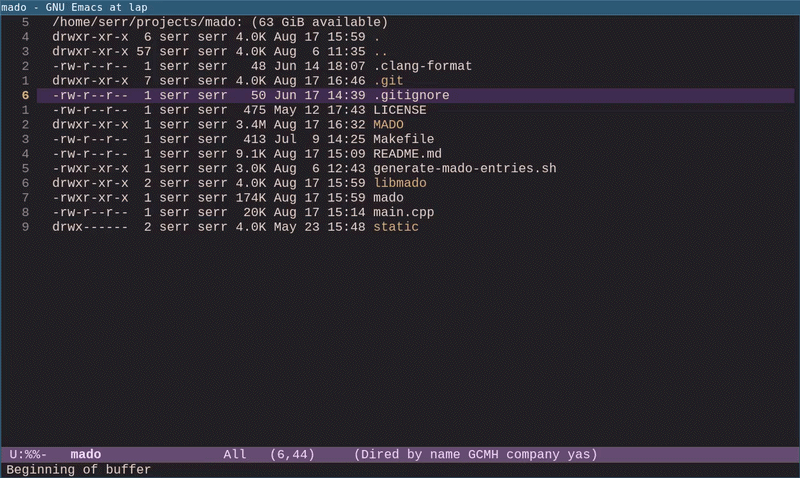

# emado - Emacs interface for mado

A pretty Emacs interface for
[mado](https://github.com/laserattack/mado) — a markdown-based
task/notes organizer

Entries stored as `MAIN.md` files in timestamped directories
(`YYYYMMDDTHHMMSS/MAIN.md`) in `MADO/` directory. The entry directory
can also contain any additional files related to the entry —
attachments, screenshots, logs, scripts, etc. Everything stays
organized in one place

## Usage example



Detailed documentation is available in the
[mado](https://github.com/laserattack/mado) repository

## Installation

To install, copy `emado.el` to a directory in your Emacs
`load-path`. Then add this to your configuration:

```elisp
(require 'emado)
(emado-default-bindings)
```

This binds `C-c e` to `emado-info`, which opens the emado buffer
showing repository statistics. From there, press `h` to open the main
menu with all available commands

Or use your own keybinding instead:

```elisp
(require 'emado)
(global-set-key (kbd "C-c m") 'emado-info)
```

## Requirements

- Emacs 28.1 or later
- `mado` executable in `PATH`
